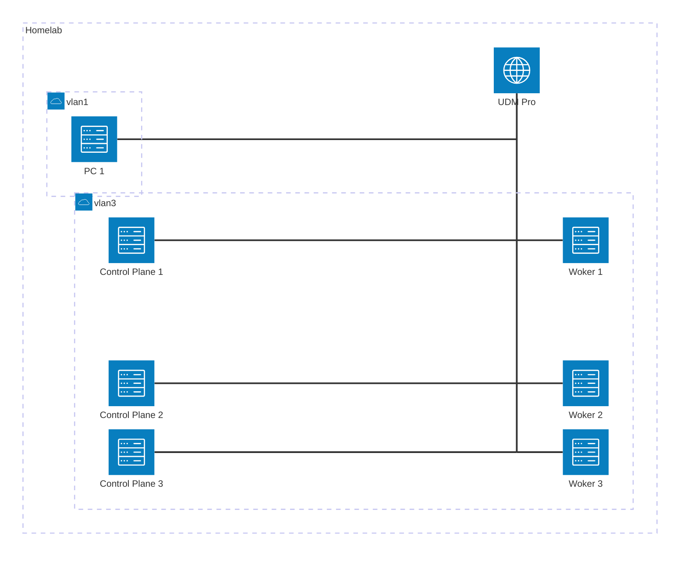

# Cilium

## BGP

Diagram the BGP connections.

VLAN1 operates in `192.168.1.X`

VLAN3 operates in `192.168.5.X`

VLAN4 operates in `192.168.6.X`

- where lb-services will live
- what UDM Pro advertises

| Machine | IP |
| ------- | -- |
| Control Plane 1 | `192.168.5.100` |
| Control Plane 2 | `192.168.5.101` |
| Control Plane 3 | `192.168.5.102` |
| Worker 1 | `192.168.5.103` |
| Worker 1 | `192.168.5.104` |
| Worker 1 | `192.168.5.105` |
